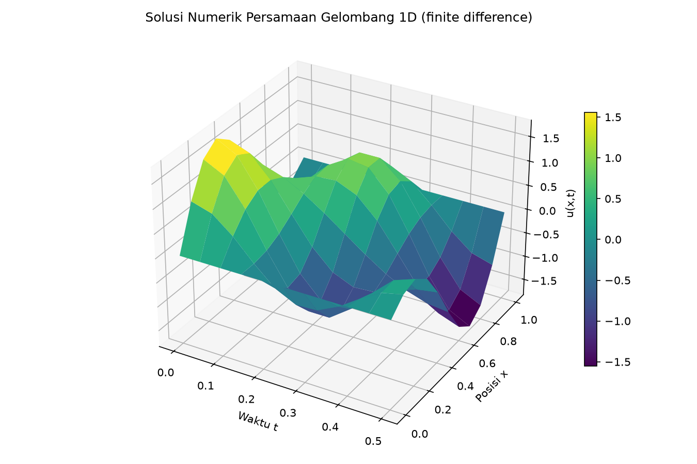
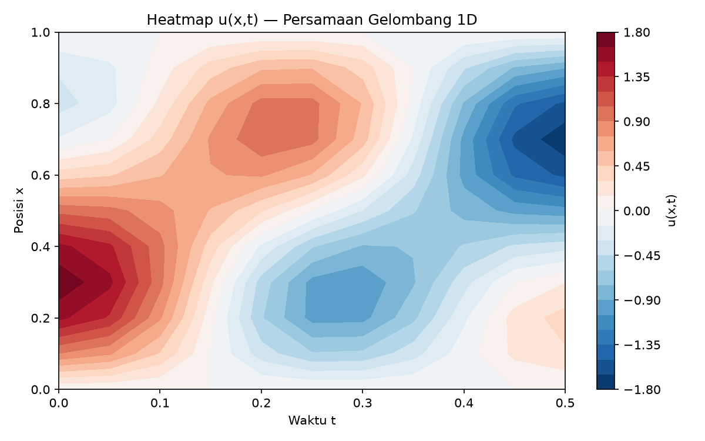
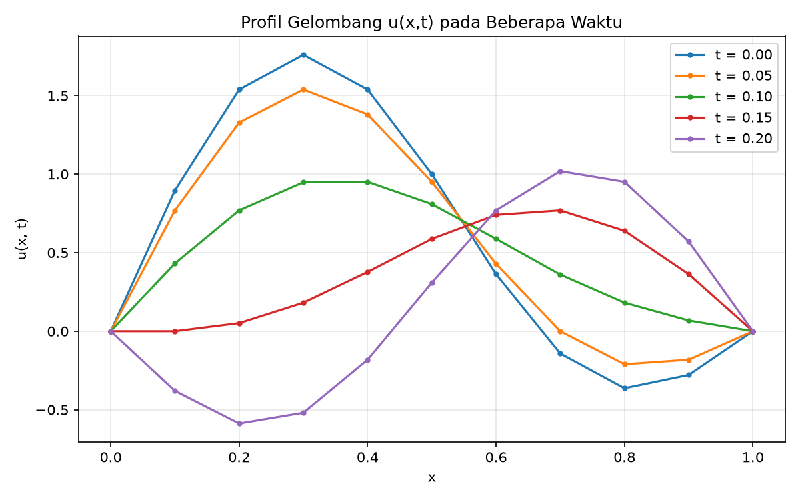

# Persamaan Gelombang 1D — Metode Finite Difference

Proyek UTS **Fisika Komputasi Lanjut** (Semester 6): simulasi persamaan gelombang satu dimensi menggunakan metode beda hingga (finite difference).
Menyimpan klon dari folder backup `.../Semester 6/Fiskom lanjut/UTS`.

## Persamaan

Persamaan gelombang 1D yang disimulasikan:

    ∂²u/∂t² = c² · ∂²u/∂x²   ,   x ∈ [0,1], t ∈ [0, 0.5]

dengan c = 2 (c² = 4), syarat awal:

    u(x,0) = sin(πx) + sin(2πx)   ,   ∂u/∂t (x,0) = 0

dan syarat batas:

    u(0,t) = u(1,t) = 0

Diskretisasi eksplisit (leapfrog / central difference):

    uᵢ,ⱼ₊₁ = r(uᵢ₊₁,ⱼ + uᵢ₋₁,ⱼ) + 2(1−r)uᵢ,ⱼ − uᵢ,ⱼ₋₁

dengan `r = (c·dt/dx)² = 1` (diperoleh dari dx = 0.1, dt = 0.05), yang memenuhi syarat stabilitas CFL (r ≤ 1). Langkah waktu pertama dihitung dari `u_t(x,0) = 0`:
`uᵢ,₁ = ½(uᵢ₋₁,₀ + uᵢ₊₁,₀)`.

## Isi Repo

| File                    | Keterangan                                             |
|-------------------------|--------------------------------------------------------|
| `pers_gel.cpp`          | Implementasi C++ (eksplicit finite difference, output matrix 11×11) |
| `Pers_Gel_project_1.m`  | Implementasi MATLAB + plot `surf` solusi u(x,t)        |
| `apa.pdf`               | Laporan/artefak UTS                                    |
| `Project 1 Persamaan Gelombang.xlsx` | Tabel hasil numerik                     |
| `UNTITLED.opju`         | Proyek Origin (di-ignore dari git)                     |
| `pers_gel.exe`          | Biner Windows hasil kompilasi (di-ignore dari git)     |
| `results/`              | Plot hasil regenerasi dari data xlsx                   |
| `results/u_data.npy`    | Data numerik u(x,t) hasil ekstraksi dari xlsx          |

## Hasil

Plot di bawah dibuat ulang dari data numerik `Project 1 Persamaan Gelombang.xlsx`
(cocok dengan output `pers_gel.cpp`, min/maks ±1.76007).

## Menjalankan

C++ (Linux/macOS):

    g++ -std=c++17 -O2 -o pers_gel pers_gel.cpp -lm && ./pers_gel

MATLAB/Octave:

    run('Pers_Gel_project_1.m')   # menampilkan surf u(x,t)

## Struktur Grid

- `Nx = 11` titik ruang (x = 0 s.d. 1, step 0.1)
- `Nt = 11` langkah waktu (t = 0 s.d. 0.5, step 0.05)
- Matriks solusi `u[i][j]`, i = posisi, j = waktu
# Inf-wave-eq-CPP
